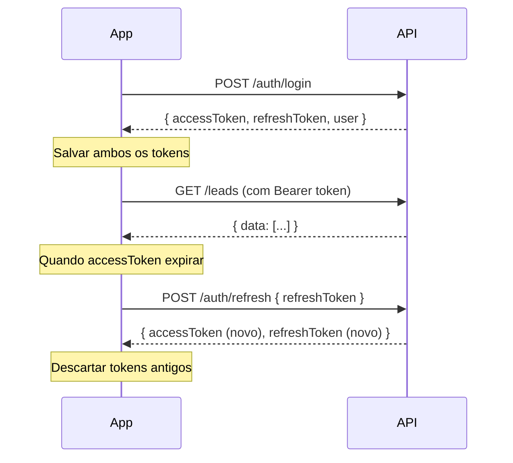

# 📋 CRM API — Guia de Integração Frontend

> **Base URL:** `http://localhost:3000`
> **Swagger:** `http://localhost:3000/api/docs`
> **Versão:** 1.0

---

## 📑 Índice

1. [Padrão de Respostas](#1-padrão-de-respostas)
2. [Autenticação](#2-autenticação)
3. [Enums (valores aceitos)](#3-enums)
4. [Auth](#4-auth)
5. [Leads](#5-leads)
6. [Appointments (Agenda)](#6-appointments)
7. [Catalog (Catálogo)](#7-catalog)
8. [Finance (Financeiro)](#8-finance)
9. [Reports (Relatórios)](#9-reports)

---

## 1. Padrão de Respostas

### ✅ Sucesso

Todas as respostas de sucesso são encapsuladas neste formato:

```json
{
  "data": { ... },
  "message": "Success"
}
```

### ❌ Erro

```json
{
  "statusCode": 401,
  "message": "Invalid credentials",
  "error": "Unauthorized"
}
```

Erros de validação retornam um array de mensagens:

```json
{
  "statusCode": 400,
  "message": [
    "email must be an email",
    "Password must contain at least one uppercase letter and one number"
  ],
  "error": "Bad Request"
}
```

### Códigos HTTP Comuns

| Código | Significado |
|--------|------------|
| `200` | OK |
| `201` | Criado com sucesso |
| `400` | Erro de validação / Bad Request |
| `401` | Não autenticado |
| `403` | Sem permissão / Token reusado |
| `404` | Recurso não encontrado |
| `409` | Conflito (ex: email já registrado) |
| `429` | Rate limit atingido |

---

## 2. Autenticação

Todos os endpoints (exceto `register`, `login`, `refresh`) exigem o header:

```
Authorization: Bearer <accessToken>
```

### Fluxo de Tokens



> [!IMPORTANT]
> O refresh token sofre **rotação**: a cada uso, o antigo é revogado e um novo par (access + refresh) é retornado. Se o front reutilizar um refresh token já usado, **TODAS** as sessões do usuário serão revogadas (proteção contra replay attack).

---

## 3. Enums

### `LeadOrigin` — Origem do lead
```
indicacao | instagram | facebook | whatsapp | site | telefone | outro
```

### `FunnelStage` — Estágio do funil
```
novo | contatado | negociando | fechado | perdido
```

### `AppointmentType` — Tipo de compromisso
```
ligacao | visita | reuniao | retorno | outro
```

### `TransactionType` — Tipo de transação financeira
```
entrada | saida
```

### `Plan` — Plano do usuário
```
free | pro
```

---

## 4. Auth

### 4.1 Registrar
```
POST /auth/register
```
> 🔓 Público — Rate limit: 5 req/min

**Body:**
| Campo | Tipo | Obrigatório | Regras | Exemplo |
|-------|------|-------------|--------|---------|
| `email` | `string` | ✅ | Email válido | `"usuario@email.com"` |
| `password` | `string` | ✅ | Min 8 chars, 1 maiúscula, 1 número | `"Senha123"` |
| `name` | `string` | ❌ | — | `"João Silva"` |

**Response `201`:**
```json
{
  "data": {
    "accessToken": "eyJhbGci...",
    "refreshToken": "a1b2c3d4...",
    "user": {
      "id": "uuid",
      "email": "usuario@email.com",
      "name": "João Silva"
    }
  },
  "message": "Success"
}
```

**Exemplo cURL:**
```bash
curl -X POST http://localhost:3000/auth/register \
  -H "Content-Type: application/json" \
  -d '{
    "email": "usuario@email.com",
    "password": "Senha123",
    "name": "João Silva"
  }'
```

---

### 4.2 Login
```
POST /auth/login
```
> 🔓 Público — Rate limit: 5 req/min

**Body:**
| Campo | Tipo | Obrigatório | Exemplo |
|-------|------|-------------|---------|
| `email` | `string` | ✅ | `"usuario@email.com"` |
| `password` | `string` | ✅ | `"Senha123"` |

**Response `200`:**
```json
{
  "data": {
    "accessToken": "eyJhbGci...",
    "refreshToken": "a1b2c3d4...",
    "user": {
      "id": "uuid",
      "email": "usuario@email.com",
      "name": "João Silva"
    }
  },
  "message": "Success"
}
```

---

### 4.3 Refresh Token
```
POST /auth/refresh
```
> 🔓 Público

**Body:**
| Campo | Tipo | Obrigatório | Exemplo |
|-------|------|-------------|---------|
| `refreshToken` | `string` | ✅ | `"a1b2c3d4..."` |
| `deviceName` | `string` | ❌ | `"iPhone 15"` |

**Response `200`:**
```json
{
  "data": {
    "accessToken": "eyJhbGci... (novo)",
    "refreshToken": "x9y8z7... (novo)"
  },
  "message": "Success"
}
```

> [!WARNING]
> Substituir imediatamente o par de tokens antigo pelo novo. Reusar o token antigo causa revogação total.

---

### 4.4 Logout (sessão atual)
```
POST /auth/logout
```
> 🔒 Autenticado

**Body:**
| Campo | Tipo | Obrigatório |
|-------|------|-------------|
| `refreshToken` | `string` | ✅ |

**Response `200`:**
```json
{
  "data": { "message": "Logged out successfully" },
  "message": "Success"
}
```

---

### 4.5 Logout All (todas as sessões)
```
POST /auth/logout-all
```
> 🔒 Autenticado

**Body:** nenhum

**Response `200`:**
```json
{
  "data": { "message": "All sessions revoked" },
  "message": "Success"
}
```

---

### 4.6 Perfil do Usuário
```
GET /auth/me
```
> 🔒 Autenticado

**Response `200`:**
```json
{
  "data": {
    "id": "uuid",
    "email": "usuario@email.com",
    "name": "João Silva",
    "plan": "free",
    "createdAt": "2026-04-01T00:00:00.000Z"
  },
  "message": "Success"
}
```

---

## 5. Leads

> 🔒 Todos os endpoints de leads exigem autenticação.

### 5.1 Listar Leads
```
GET /leads
```

**Query Parameters:**
| Param | Tipo | Obrigatório | Descrição | Exemplo |
|-------|------|-------------|-----------|---------|
| `stage` | `FunnelStage` | ❌ | Filtrar por estágio | `?stage=novo` |
| `origin` | `LeadOrigin` | ❌ | Filtrar por origem | `?origin=instagram` |
| `search` | `string` | ❌ | Buscar por nome ou telefone | `?search=Maria` |

**Response `200`:**
```json
{
  "data": [
    {
      "id": "uuid",
      "userId": "uuid",
      "name": "Maria Souza",
      "phone": "11999998888",
      "cpfCnpj": "12345678901",
      "email": "maria@email.com",
      "origin": "instagram",
      "location": "São Paulo, SP",
      "observations": "Cliente indicado pelo João",
      "recurringSale": false,
      "funnelStage": "novo",
      "dealValue": "1500.00",
      "lostReason": null,
      "deletedAt": null,
      "createdAt": "2026-04-01T12:00:00.000Z",
      "updatedAt": "2026-04-01T12:00:00.000Z"
    }
  ],
  "message": "Success"
}
```

> [!NOTE]
> Leads com soft delete (`deletedAt != null`) não são retornados nesta listagem.

---

### 5.2 Buscar Lead por ID
```
GET /leads/:id
```

**Response `200`:**
```json
{
  "data": {
    "id": "uuid",
    "name": "Maria Souza",
    "phone": "11999998888",
    "cpfCnpj": "12345678901",
    "email": "maria@email.com",
    "origin": "instagram",
    "location": "São Paulo, SP",
    "observations": "Cliente indicado pelo João",
    "recurringSale": false,
    "funnelStage": "novo",
    "dealValue": "1500.00",
    "lostReason": null,
    "deletedAt": null,
    "createdAt": "2026-04-01T12:00:00.000Z",
    "updatedAt": "2026-04-01T12:00:00.000Z",
    "_count": {
      "appointments": 2
    }
  },
  "message": "Success"
}
```

---

### 5.3 Criar Lead
```
POST /leads
```

**Body:**
| Campo | Tipo | Obrigatório | Regras | Exemplo |
|-------|------|-------------|--------|---------|
| `name` | `string` | ✅ | — | `"Maria Souza"` |
| `phone` | `string` | ✅ | — | `"11999998888"` |
| `cpfCnpj` | `string` | ❌ | — | `"12345678901"` |
| `email` | `string` | ❌ | Email válido | `"maria@email.com"` |
| `origin` | `LeadOrigin` | ❌ | Default: `outro` | `"instagram"` |
| `location` | `string` | ❌ | — | `"São Paulo, SP"` |
| `observations` | `string` | ❌ | — | `"Cliente indicado"` |
| `recurringSale` | `boolean` | ❌ | Default: `false` | `false` |
| `funnelStage` | `FunnelStage` | ❌ | Default: `novo` | `"novo"` |
| `dealValue` | `number` | ❌ | Mínimo: 0 | `1500.00` |

**Exemplo cURL:**
```bash
curl -X POST http://localhost:3000/leads \
  -H "Authorization: Bearer eyJhbGci..." \
  -H "Content-Type: application/json" \
  -d '{
    "name": "Maria Souza",
    "phone": "11999998888",
    "origin": "instagram",
    "dealValue": 1500
  }'
```

---

### 5.4 Atualizar Lead
```
PATCH /leads/:id
```

**Body:** Mesmo campos do criar, todos opcionais (PartialType)

---

### 5.5 Atualizar Estágio do Funil
```
PATCH /leads/:id/stage
```

**Body:**
| Campo | Tipo | Obrigatório | Regras | Exemplo |
|-------|------|-------------|--------|---------|
| `funnelStage` | `FunnelStage` | ✅ | Enum válido | `"negociando"` |
| `lostReason` | `string` | ❌ | Recomendado quando `funnelStage = "perdido"` | `"Preço acima do orçamento"` |

> [!TIP]
> Quando o estágio é alterado para algo diferente de `"perdido"`, o `lostReason` é automaticamente limpo (setado como `null`).

---

### 5.6 Excluir Lead (Soft Delete)
```
DELETE /leads/:id
```

**Response `200`:** Retorna o lead com `deletedAt` preenchido.

---

## 6. Appointments

> 🔒 Todos os endpoints exigem autenticação.

### 6.1 Listar Compromissos
```
GET /appointments
```

**Query Parameters:**
| Param | Tipo | Obrigatório | Descrição | Exemplo |
|-------|------|-------------|-----------|---------|
| `month` | `number` | ❌ | Mês (1-12) — usar com `year` | `?month=4` |
| `year` | `number` | ❌ | Ano — usar com `month` | `?year=2026` |
| `from` | `string` | ❌ | Data início (`YYYY-MM-DD`) | `?from=2026-04-01` |
| `to` | `string` | ❌ | Data fim (`YYYY-MM-DD`) | `?to=2026-04-30` |
| `leadId` | `UUID` | ❌ | Filtrar por lead | `?leadId=uuid` |
| `completed` | `boolean` | ❌ | Filtrar por status | `?completed=false` |

> [!NOTE]
> Use `month` + `year` para a visão mensal do calendário. Use `from` + `to` para intervalos customizados. Se ambos forem enviados, `month`/`year` tem prioridade.

**Response `200`:**
```json
{
  "data": [
    {
      "id": "uuid",
      "userId": "uuid",
      "leadId": "uuid",
      "title": "Reunião com cliente",
      "description": "Discutir proposta",
      "type": "reuniao",
      "date": "2026-04-15T00:00:00.000Z",
      "startTime": "09:00",
      "endTime": "10:00",
      "allDay": false,
      "color": "#4F46E5",
      "completed": false,
      "createdAt": "2026-04-01T12:00:00.000Z",
      "updatedAt": "2026-04-01T12:00:00.000Z",
      "lead": {
        "id": "uuid",
        "name": "Maria Souza",
        "phone": "11999998888"
      }
    }
  ],
  "message": "Success"
}
```

---

### 6.2 Compromissos Próximos (7 dias)
```
GET /appointments/upcoming
```

Retorna compromissos dos próximos 7 dias que **não foram concluídos**.

---

### 6.3 Compromissos por Data Específica
```
GET /appointments/date/:date
```

| Param | Tipo | Exemplo |
|-------|------|---------|
| `:date` | `string` | `/appointments/date/2026-04-15` |

---

### 6.4 Criar Compromisso
```
POST /appointments
```

**Body:**
| Campo | Tipo | Obrigatório | Regras | Exemplo |
|-------|------|-------------|--------|---------|
| `title` | `string` | ✅ | — | `"Reunião com cliente"` |
| `date` | `string` | ✅ | Formato `YYYY-MM-DD` | `"2026-04-15"` |
| `type` | `AppointmentType` | ❌ | Default: `outro` | `"reuniao"` |
| `startTime` | `string` | ❌ | Formato `HH:mm` | `"09:00"` |
| `endTime` | `string` | ❌ | Formato `HH:mm`, deve ser > `startTime` | `"10:00"` |
| `allDay` | `boolean` | ❌ | Default: `false`. Se `true`, ignora horários | `false` |
| `leadId` | `UUID` | ❌ | Associar a um lead | `"uuid"` |
| `description` | `string` | ❌ | — | `"Discutir proposta"` |
| `color` | `string` | ❌ | Formato `#RRGGBB` | `"#4F46E5"` |

> [!TIP]
> Quando `allDay: true`, os campos `startTime` e `endTime` são automaticamente descartados (setados como `null`).

---

### 6.5 Atualizar Compromisso
```
PATCH /appointments/:id
```

**Body:** Mesmo campos do criar, todos opcionais.

---

### 6.6 Marcar como Concluído
```
PATCH /appointments/:id/complete
```

**Body:** nenhum

**Response `200`:** Retorna o appointment com `completed: true`.

---

### 6.7 Excluir Compromisso
```
DELETE /appointments/:id
```

> [!CAUTION]
> É um **hard delete** — o compromisso é removido permanentemente do banco.

---

## 7. Catalog

> 🔒 Todos os endpoints exigem autenticação.

### 7.1 Categorias

#### Listar Categorias
```
GET /catalog/categories
```

**Response `200`:**
```json
{
  "data": [
    {
      "id": "uuid",
      "userId": "uuid",
      "name": "Serviços de Beleza",
      "createdAt": "2026-04-01T00:00:00.000Z",
      "_count": {
        "products": 5
      }
    }
  ],
  "message": "Success"
}
```

#### Criar Categoria
```
POST /catalog/categories
```

**Body:**
| Campo | Tipo | Obrigatório | Exemplo |
|-------|------|-------------|---------|
| `name` | `string` | ✅ | `"Serviços de Beleza"` |

#### Atualizar Categoria
```
PATCH /catalog/categories/:id
```

**Body:**
| Campo | Tipo | Obrigatório | Exemplo |
|-------|------|-------------|---------|
| `name` | `string` | ❌ | `"Tratamentos"` |

#### Excluir Categoria
```
DELETE /catalog/categories/:id
```

> [!CAUTION]
> Hard delete com **cascade**: todos os produtos associados à categoria serão excluídos junto.

---

### 7.2 Produtos

#### Listar Produtos
```
GET /catalog/products
```

**Response `200`:**
```json
{
  "data": [
    {
      "id": "uuid",
      "userId": "uuid",
      "categoryId": "uuid",
      "name": "Corte de Cabelo",
      "price": "50.00",
      "durationDays": 30,
      "createdAt": "2026-04-01T00:00:00.000Z",
      "updatedAt": "2026-04-01T00:00:00.000Z",
      "category": {
        "id": "uuid",
        "name": "Serviços de Beleza"
      }
    }
  ],
  "message": "Success"
}
```

#### Criar Produto
```
POST /catalog/products
```

**Body:**
| Campo | Tipo | Obrigatório | Regras | Exemplo |
|-------|------|-------------|--------|---------|
| `categoryId` | `UUID` | ✅ | Deve pertencer ao usuário | `"uuid"` |
| `name` | `string` | ✅ | — | `"Corte de Cabelo"` |
| `price` | `number` | ✅ | Mínimo: 0 | `50.00` |
| `durationDays` | `number` | ❌ | Inteiro, mínimo: 1 | `30` |

> [!NOTE]
> O `durationDays` é usado para calcular automaticamente a data de expiração quando o produto é associado a um lead.

#### Atualizar Produto
```
PATCH /catalog/products/:id
```

**Body:** Mesmo campos do criar, todos opcionais.

#### Excluir Produto
```
DELETE /catalog/products/:id
```

---

### 7.3 Produtos do Lead

#### Associar Produto a Lead
```
POST /leads/:id/products
```

**Body:**
| Campo | Tipo | Obrigatório | Exemplo |
|-------|------|-------------|---------|
| `productId` | `UUID` | ✅ | `"uuid"` |
| `startDate` | `string` | ✅ | `"2026-04-01"` (YYYY-MM-DD) |

**Response `201`:**
```json
{
  "data": {
    "id": "uuid",
    "leadId": "uuid",
    "productId": "uuid",
    "startDate": "2026-04-01T00:00:00.000Z",
    "expiresAt": "2026-05-01T00:00:00.000Z",
    "createdAt": "2026-04-01T12:00:00.000Z",
    "product": {
      "id": "uuid",
      "name": "Corte de Cabelo",
      "price": "50.00",
      "durationDays": 30,
      "category": {
        "id": "uuid",
        "name": "Serviços de Beleza"
      }
    }
  },
  "message": "Success"
}
```

> [!NOTE]
> Se o produto tem `durationDays`, o `expiresAt` é calculado automaticamente como `startDate + durationDays`. Caso contrário, `expiresAt` será `null`.

#### Listar Produtos de um Lead
```
GET /leads/:id/products
```

Retorna todos os produtos associados ao lead com detalhes do produto e categoria.

---

## 8. Finance

> 🔒 Todos os endpoints exigem autenticação.

### 8.1 Categorias Financeiras

#### Listar Categorias
```
GET /finance/categories
```

**Query Parameters:**
| Param | Tipo | Obrigatório | Descrição |
|-------|------|-------------|-----------|
| `type` | `TransactionType` | ❌ | Filtrar por `entrada` ou `saida` |

**Response `200`:**
```json
{
  "data": [
    {
      "id": "uuid",
      "userId": "uuid",
      "name": "Vendas",
      "type": "entrada",
      "color": "#22C55E",
      "createdAt": "2026-04-01T00:00:00.000Z",
      "_count": {
        "transactions": 12
      }
    }
  ],
  "message": "Success"
}
```

#### Criar Categoria
```
POST /finance/categories
```

**Body:**
| Campo | Tipo | Obrigatório | Regras | Exemplo |
|-------|------|-------------|--------|---------|
| `name` | `string` | ✅ | — | `"Vendas"` |
| `type` | `TransactionType` | ✅ | `entrada` ou `saida` | `"entrada"` |
| `color` | `string` | ❌ | Formato `#RRGGBB` | `"#22C55E"` |

#### Atualizar Categoria
```
PATCH /finance/categories/:id
```

**Body:** Mesmo campos do criar, todos opcionais.

#### Excluir Categoria
```
DELETE /finance/categories/:id
```

> [!CAUTION]
> Hard delete com **cascade**: todas as transações associadas serão excluídas.

---

### 8.2 Transações

#### Listar Transações
```
GET /finance/transactions
```

**Query Parameters:**
| Param | Tipo | Obrigatório | Descrição | Exemplo |
|-------|------|-------------|-----------|---------|
| `type` | `TransactionType` | ❌ | Filtrar tipo | `?type=entrada` |
| `categoryId` | `UUID` | ❌ | Filtrar por categoria | `?categoryId=uuid` |
| `month` | `number` | ❌ | Mês (1-12) — usar com `year` | `?month=4` |
| `year` | `number` | ❌ | Ano | `?year=2026` |
| `from` | `string` | ❌ | Data início (`YYYY-MM-DD`) | `?from=2026-04-01` |
| `to` | `string` | ❌ | Data fim (`YYYY-MM-DD`) | `?to=2026-04-30` |

**Response `200`:**
```json
{
  "data": [
    {
      "id": "uuid",
      "userId": "uuid",
      "categoryId": "uuid",
      "type": "entrada",
      "amount": "1500.50",
      "description": "Pagamento do cliente X",
      "date": "2026-04-01T00:00:00.000Z",
      "createdAt": "2026-04-01T12:00:00.000Z",
      "category": {
        "id": "uuid",
        "name": "Vendas",
        "type": "entrada",
        "color": "#22C55E"
      }
    }
  ],
  "message": "Success"
}
```

#### Criar Transação
```
POST /finance/transactions
```

**Body:**
| Campo | Tipo | Obrigatório | Regras | Exemplo |
|-------|------|-------------|--------|---------|
| `categoryId` | `UUID` | ✅ | Deve pertencer ao usuário | `"uuid"` |
| `type` | `TransactionType` | ✅ | Deve ser igual ao type da categoria | `"entrada"` |
| `amount` | `number` | ✅ | Mínimo: 0.01 | `1500.50` |
| `date` | `string` | ✅ | Formato `YYYY-MM-DD` | `"2026-04-01"` |
| `description` | `string` | ❌ | — | `"Pagamento do cliente X"` |

> [!IMPORTANT]
> O `type` da transação **deve ser igual** ao `type` da categoria financeira associada. Por exemplo, uma categoria do tipo `entrada` não aceita transações do tipo `saida`.

#### Atualizar Transação
```
PATCH /finance/transactions/:id
```

**Body:** Mesmo campos do criar, todos opcionais.

#### Excluir Transação
```
DELETE /finance/transactions/:id
```

---

### 8.3 Resumo Financeiro Mensal
```
GET /finance/summary
```

**Query Parameters:**
| Param | Tipo | Obrigatório | Default | Exemplo |
|-------|------|-------------|---------|---------|
| `month` | `number` | ❌ | Mês atual | `?month=4` |
| `year` | `number` | ❌ | Ano atual | `?year=2026` |

**Response `200`:**
```json
{
  "data": {
    "month": 4,
    "year": 2026,
    "total_income": 15000.00,
    "total_expense": 5000.00,
    "balance": 10000.00,
    "by_category": [
      {
        "categoryId": "uuid",
        "categoryName": "Vendas",
        "type": "entrada",
        "color": "#22C55E",
        "total": 15000.00
      },
      {
        "categoryId": "uuid",
        "categoryName": "Aluguel",
        "type": "saida",
        "color": "#EF4444",
        "total": 3000.00
      }
    ]
  },
  "message": "Success"
}
```

---

## 9. Reports

> 🔒 Autenticação obrigatória.

### 9.1 Relatório Geral do CRM
```
GET /reports/summary
```

**Query Parameters:**
| Param | Tipo | Obrigatório | Default | Exemplo |
|-------|------|-------------|---------|---------|
| `from` | `string` | ❌ | Primeiro dia do mês atual | `?from=2026-04-01` |
| `to` | `string` | ❌ | Último dia do mês atual | `?to=2026-04-30` |

**Response `200`:**
```json
{
  "data": {
    "period": {
      "from": "2026-04-01T00:00:00.000Z",
      "to": "2026-04-30T00:00:00.000Z"
    },
    "total_leads": 45,
    "total_closed": 12,
    "conversion_rate": 26.67,
    "total_revenue": 35000.00,
    "leads_by_origin": [
      { "origin": "instagram", "count": 15 },
      { "origin": "indicacao", "count": 10 },
      { "origin": "whatsapp", "count": 8 },
      { "origin": "site", "count": 7 },
      { "origin": "outro", "count": 5 }
    ],
    "leads_by_week": [
      { "week": "2026-W14", "count": 12 },
      { "week": "2026-W15", "count": 15 },
      { "week": "2026-W16", "count": 10 },
      { "week": "2026-W17", "count": 8 }
    ],
    "lost_leads": [
      {
        "id": "uuid",
        "name": "Cliente Perdido",
        "lostReason": "Preço acima do orçamento",
        "createdAt": "2026-04-01T12:00:00.000Z"
      }
    ]
  },
  "message": "Success"
}
```

---

## 📌 Resumo Rápido de Endpoints

| Método | Endpoint | Descrição | Auth |
|--------|----------|-----------|------|
| `POST` | `/auth/register` | Registrar novo usuário | ❌ |
| `POST` | `/auth/login` | Login | ❌ |
| `POST` | `/auth/refresh` | Renovar tokens | ❌ |
| `POST` | `/auth/logout` | Logout sessão atual | ✅ |
| `POST` | `/auth/logout-all` | Logout todas sessões | ✅ |
| `GET` | `/auth/me` | Perfil do usuário | ✅ |
| | | | |
| `GET` | `/leads` | Listar leads | ✅ |
| `GET` | `/leads/:id` | Detalhe do lead | ✅ |
| `POST` | `/leads` | Criar lead | ✅ |
| `PATCH` | `/leads/:id` | Atualizar lead | ✅ |
| `PATCH` | `/leads/:id/stage` | Atualizar estágio do funil | ✅ |
| `DELETE` | `/leads/:id` | Soft delete lead | ✅ |
| | | | |
| `GET` | `/appointments` | Listar compromissos | ✅ |
| `GET` | `/appointments/upcoming` | Próximos 7 dias | ✅ |
| `GET` | `/appointments/date/:date` | Por data específica | ✅ |
| `POST` | `/appointments` | Criar compromisso | ✅ |
| `PATCH` | `/appointments/:id` | Atualizar compromisso | ✅ |
| `PATCH` | `/appointments/:id/complete` | Marcar concluído | ✅ |
| `DELETE` | `/appointments/:id` | Excluir compromisso | ✅ |
| | | | |
| `GET` | `/catalog/categories` | Listar categorias catálogo | ✅ |
| `POST` | `/catalog/categories` | Criar categoria | ✅ |
| `PATCH` | `/catalog/categories/:id` | Atualizar categoria | ✅ |
| `DELETE` | `/catalog/categories/:id` | Excluir categoria (cascade) | ✅ |
| `GET` | `/catalog/products` | Listar produtos | ✅ |
| `POST` | `/catalog/products` | Criar produto | ✅ |
| `PATCH` | `/catalog/products/:id` | Atualizar produto | ✅ |
| `DELETE` | `/catalog/products/:id` | Excluir produto | ✅ |
| `POST` | `/leads/:id/products` | Associar produto ao lead | ✅ |
| `GET` | `/leads/:id/products` | Listar produtos do lead | ✅ |
| | | | |
| `GET` | `/finance/categories` | Listar categorias financeiras | ✅ |
| `POST` | `/finance/categories` | Criar categoria financeira | ✅ |
| `PATCH` | `/finance/categories/:id` | Atualizar categoria | ✅ |
| `DELETE` | `/finance/categories/:id` | Excluir categoria (cascade) | ✅ |
| `GET` | `/finance/transactions` | Listar transações | ✅ |
| `POST` | `/finance/transactions` | Criar transação | ✅ |
| `PATCH` | `/finance/transactions/:id` | Atualizar transação | ✅ |
| `DELETE` | `/finance/transactions/:id` | Excluir transação | ✅ |
| `GET` | `/finance/summary` | Resumo financeiro mensal | ✅ |
| | | | |
| `GET` | `/reports/summary` | Relatório geral do CRM | ✅ |
